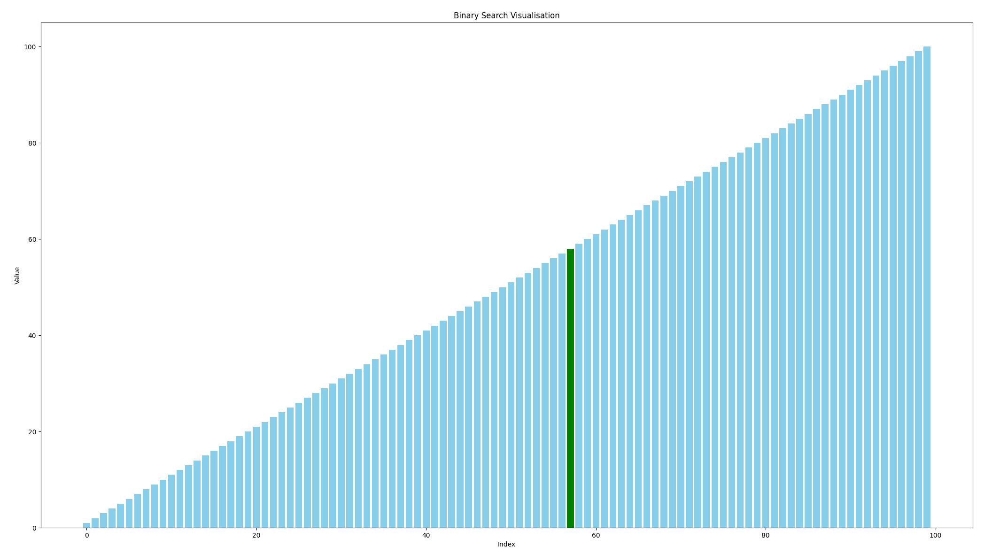

# Python Binary Search Visualiser

    

This program is to test a basic binary search algorithm, and include a visualiser.

# Contribution 

If you'd like to contribute to `python_binary_search_visualiser` please submit a pull-request on a feature branch.

# Installing

Clone the repo:

    git clone https://github.com/Sommos/python_binary_search_visualiser

    cd python_binary_search_visualiser
